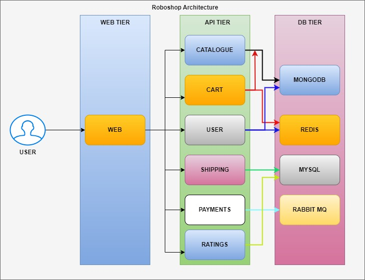

# RobotShop-Microservices-Sandbox
## Project Overview
RobotShop Microservices Sandbox is a customized version of `Stan's RobotShop`, originally developed by IBM and licensed under the Apache License 2.0. This version includes modifications that serve as a sandbox for my personal exploration and demonstration of cloud-native technologies and DevOps tools, simulating real-world applications.

RobotShop simulates an e-commerce platform that sells robots and AI products, providing a practical environment to test and apply concepts like scalability, fault tolerance, and container orchestration. It’s built as a sample microservices application, where each service is designed to mirror real-world e-commerce functionality and is developed using various languages and frameworks to reflect an industry-grade architecture.

Originally, IBM created Stan's RobotShop to showcase their Instana APM (Application Performance Monitoring) tool. For the original project, you can visit the Stan's RobotShop GitHub Repository [here](https://github.com/instana/robot-shop). This project provides an excellent foundation to dive into various cloud-native tools and technologies.

I’ve adopted this project as a personal PoC (Proof of Concept), to experiment with various tools and integrate advanced technologies. This project provides an excellent foundation to showcase different DevOps tools and technologies in a real-world context. It's not just a demo, it's an evolving testbed for my skills.

## RobotShop PoC: Microservices Architecture for E-commerce

  
   
  <em>Figure 1: Architecture Diagram</em>

**1. Frontend Tier (Presentation Layer):**
- The `Web Service` serves as the main entry point, handling user interactions and relaying requests to the API Tier for processing. 

**2. API Tier (Business Logic Layer):** This core layer processes user requests and applies business logic to manage various e-commerce functions.
- `User Service`: Manages user data, authentication, and session control.
- `Catalogue Service`: Handles the listing, retrieval, and management of product details for customers.
- `Cart Service`: Tracks items within a user’s cart and updates quantities and preferences as required.
- `Payments Service`: Manages transaction processes and ensures secure payment data handling.
- `Shipping Service`: Calculates and manages shipping requirements based on the user’s location and order.
- `Ratings Service`: Manages product reviews, ratings, and feedback from users.

**3. Data Tier (Database/Storage Layer):** This layer supports persistent data storage for the application.
- `MongoDB`: Used by the Catalogue Service to store and manage unstructured product data.
- `Redis`: Provides caching and manages real-time session data, enhancing performance for high-frequency transactions.
- `MySQL`: Stores structured data, such as order history and customer transactions, supporting complex querying needs.
- `RabbitMQ`: Serves as a message broker for asynchronous communication, managing queues between services to ensure reliability.

## Key Interactions:
- The Frontend Tier communicates directly with the API Tier to process user commands.
- Services within the API Tier interact with corresponding components in the Data Tier to fetch or store data.
- RabbitMQ facilitates asynchronous communication across services, managing message queues for seamless coordination.

**Note**: The purpose of this project is hands-on experimentation. Therefore, the focus is on flexible deployment, resilience, and monitoring setups, rather than production-level security.